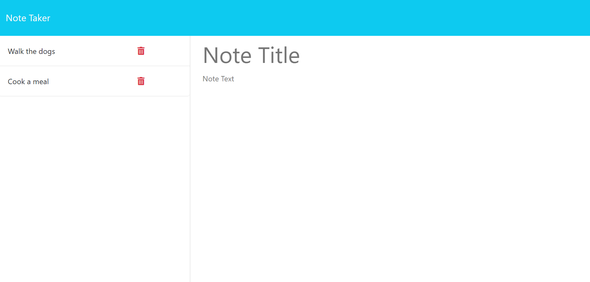

# Note Taker 📝

| _Category_           | _Details_                                                                                                                                                                                                                                                                                                                                                                                                                                  |
| -------------------- | ------------------------------------------------------------------------------------------------------------------------------------------------------------------------------------------------------------------------------------------------------------------------------------------------------------------------------------------------------------------------------------------------------------------------------------------ |
| _Description_        | Note Taker is a web application designed to assist small business owners in organizing their thoughts and keeping track of tasks. Whether you need to jot down ideas, create to-do lists, or save important information, Note Taker provides a simple and effective platform to manage your notes.                                                                                                                                         |
| _Features 🌟_        | - _User-friendly Interface:_ An intuitive interface that allows users to easily navigate and manage their notes.   - _Create and Save Notes:_ Enter new note titles and text, and save them for future reference.   - _List of Existing Notes:_ View a list of existing notes in the left-hand column for quick access.   - _Clear Form Functionality:_ Clear the note entry form with the "Clear Form" button for a fresh start. |
| _Screenshots 🖼️_     |                                                                                                                                                                                                                                                                                                                                                                                                                     |
| \*Getting Started 🚀 | 1. \*_Clone the repository:_ `https://github.com/Andatax/note-taker`   2. _Navigate to the directory:_ `cd NoteTaker`   3. _Open the index.html file in your preferred web browser._                                                                                                                                                                                                                                                 |
| Deployed app         | https://note-taker-practice-cebc5d05dc46.herokuapp.com/                                                                                                                                                                                                                                                                                                                                                                                 |
| _Usage Instructions_ | 1. Open the Note Taker application.   2. Click on the "Notes" link on the landing page.   3. Enter a new note title and note text in the right-hand column.   4. Click the "Save Note" button to save your note.   5. To view or edit an existing note, click on the note in the left-hand column.   6. Use the "New Note" button in the navigation to create a new note after viewing an existing one.                     |
| _License 📜_         | This project is licensed under the MIT License.                                                                                                                                                                                                                                                                                                                                                                                            |

## Technology Used

- _HTML and CSS:_ For the design and layout of the application.

- _JavaScript (JS):_ For the functionality and interactivity of the application.

- _Event Handling:_ JavaScript is used to handle user interactions, such as button clicks.

- _Responsive Design:_ CSS is employed to create a responsive layout, ensuring a consistent and user-friendly experience across various devices and screen sizes.
- _Expres JS:_ Express to create a server for the application and routes to handle HTTP requests and responses.
